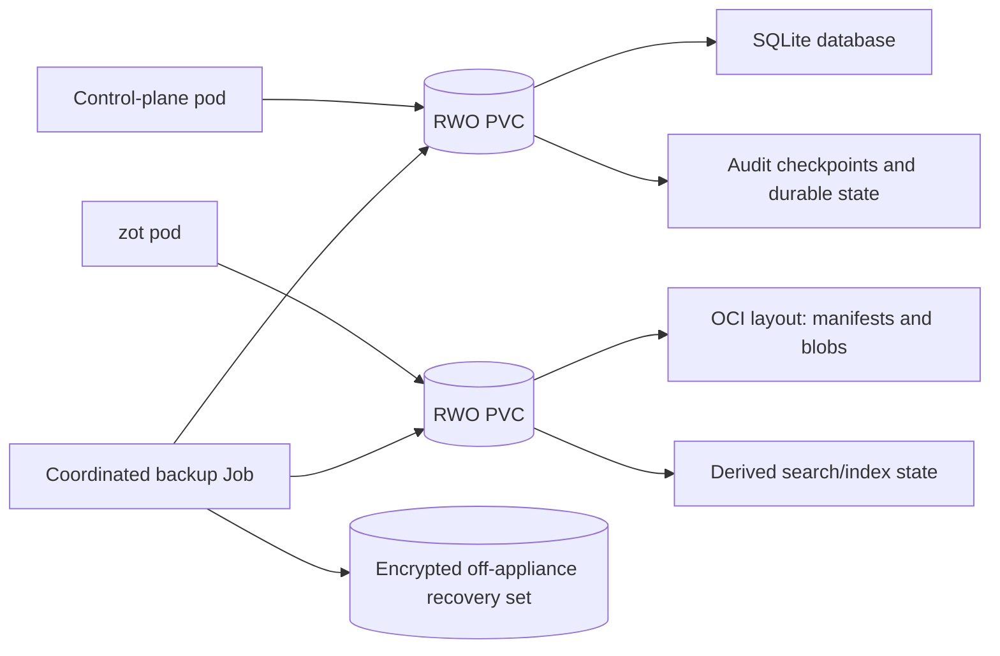

# K3s Deployment Topology

This document is the visual reference for the appliance's production K3s layout. It distinguishes always-running product pods, the Argo workflow engine, temporary workflow task pods, K3s-managed platform pods, storage, and external systems.

## System View

```mermaid
flowchart TD
    Client["Clients<br/>REST / MCP / Podman / Skopeo / ORAS / Helm"]
    Source["Allowlisted internal Git source"]
    BackupTarget[("Operator-provided local backup target")]

    subgraph Node["Dedicated single-node K3s appliance"]
        subgraph IngressNS["K3s ingress namespace"]
            Traefik["Traefik pod<br/>HTTPS ingress"]
        end

        subgraph AppNS["appliance-system namespace"]
            Control["Control-plane pod<br/>One Go server replica<br/>REST + MCP + auth + RBAC + orchestration"]
            Zot["zot pod<br/>One registry replica<br/>OCI data plane"]
            ControlPVC[("Control-plane RWO PVC<br/>SQLite + durable application state")]
            ZotPVC[("zot RWO PVC<br/>OCI manifests + blobs + indexes")]
        end

        subgraph WorkflowNS["workflows namespace"]
            Argo["Argo Workflow Controller pod<br/>Internal workflow reconciliation"]
        end

        subgraph BuildNS["appliance-builds namespace"]
            Build["Ephemeral Buildah task pod<br/>Created by an Argo Workflow"]
            Scan["Ephemeral Syft / Grype task pod<br/>SBOM + vulnerability evidence"]
            ImageOps["Ephemeral Skopeo / ORAS task pod<br/>Inspect + verify + copy + artifact operations"]
        end

        subgraph OpsNS["appliance-operations namespace"]
            Backup["Backup CronJob pod<br/>Runs only on schedule"]
            Upgrade["Upgrade / restore Job pod<br/>Operator initiated"]
        end

        subgraph K3sSystem["K3s-managed platform pods"]
            K3sAPI["Kubernetes API and controllers"]
            DNS["CoreDNS"]
            Storage["Local-path storage provisioner"]
            Metrics["Metrics server"]
            Network["K3s networking and service load balancer"]
        end
    end

    Client -->|"TCP 443"| Traefik
    Traefik -->|"/api/v1/* and /mcp"| Control
    Traefik -.->|ForwardAuth<br/>"/internal/auth/check"| Control
    Traefik -->|"/v2/*"| Zot

    Control --> ControlPVC
    Zot --> ZotPVC
    Control -->|"Submit, observe, and terminate constrained Workflows"| K3sAPI
    Argo -->|"Watch Workflows and reconcile task pods"| K3sAPI
    K3sAPI -->|"Workflow status"| Control
    Argo -.->|"Creates and supervises"| Build
    Argo -.->|"Creates and supervises"| Scan
    Argo -.->|"Creates and supervises"| ImageOps

    Build -->|"Fetch immutable commit"| Source
    Build -->|"Publish OCI image"| Zot
    Scan -->|"Read image by digest"| Zot
    ImageOps -->|"OCI image/artifact operations"| Zot

    Backup --> ControlPVC
    Backup --> ZotPVC
    Backup --> BackupTarget
    Upgrade --> ControlPVC
    Upgrade --> ZotPVC
```

## Always-Running Product Pods

| Pod | Replicas | Public route | Responsibility |
| --- | ---: | --- | --- |
| Control plane | 1 | `/api/v1/*`, `/mcp` | REST, MCP, local identity, sessions, API tokens, RBAC, registry-token issuance, internal ForwardAuth decisions, audit, builds, artifact metadata, reconciliation, and internal maintenance scheduling |
| zot | 1 | `/v2/*` | OCI manifests, tags, digests, referrers, blobs, enhanced search, scrub, deduplication, garbage collection, and internal events |
| Argo Workflow Controller | 1 | None | Watches appliance-owned `Workflow` resources and reconciles build, scan, and image-operation task pods |
| Traefik | K3s-managed | TCP 443 | TLS termination, canonical-host enforcement, request limits, and routing to the control plane or zot |

SQLite runs inside the control-plane process and stores files on its PVC. It is not a separate pod. MCP is part of the same Go server and is not a separate pod. Argo Server and its UI are not deployed in v1: the Workflow Controller can operate independently, and the appliance control plane remains the only user-facing workflow API.

## Temporary Workload Pods

| Workload | Creation model | Lifetime | Important controls |
| --- | --- | --- | --- |
| Buildah build | One appliance-generated Argo Workflow per build | Until success, failure, cancellation, or deadline | Rootless, non-privileged task pod, no host runtime socket, `emptyDir` workspace, short-lived credentials, default-deny network policy, resource and log limits |
| Syft/Grype analysis | Workflow task per requested image analysis | Until evidence is persisted | Image selected by digest, pinned scanner and database identities, read-only registry scope, bounded output |
| Skopeo/ORAS utility | Workflow task per server-side inspect/copy/promotion/artifact operation when needed | Until operation completes | Structured arguments only, isolated auth file, destination-scoped credentials, digest verification, idempotent reconciliation |
| Backup | Kubernetes CronJob plus on-demand operator run | Scheduled maintenance window | Quiesces relevant background work, captures consistent SQLite/zot state, encrypts and exports off appliance, verifies checksums |
| Upgrade/restore | Explicit operator-controlled Job or node-level installer operation | Maintenance window | Preflight, verified backup, compatibility checks, exclusive locks, restore-based rollback |

The control-plane server does not run arbitrary shell commands in HTTP handlers and does not accept arbitrary user-supplied Workflow YAML. It renders versioned, allowlisted workflow templates through a typed adapter. Argo owns task scheduling and pod reconciliation; the control plane owns authentication, authorization, business state, audit, cancellation intent, and result acceptance.

Completed Workflow resources have a bounded TTL. The control-plane SQLite database is authoritative for durable build/workflow history, so v1 does not enable Argo workflow archive/offloading or add a database for Argo.

## K3s Platform Pods

K3s supplies and owns its normal platform components, including:

- Kubernetes API and controllers
- CoreDNS
- local-path storage provisioner
- metrics server
- Traefik and service load-balancer components
- cluster networking components

These are substrate services rather than appliance feature modules. Their exact images and versions are pinned indirectly through the accepted K3s release compatibility manifest.

## Network Paths

| Source | Destination | Allowed purpose |
| --- | --- | --- |
| External clients | Traefik TCP 443 | Canonical HTTPS entry point only |
| Traefik | Control plane public listener | REST and MCP routes, plus cluster-internal ForwardAuth checks at `/internal/auth/check` for protected app ingress |
| Traefik | zot | OCI `/v2/*` data path |
| Control plane | Kubernetes API | Create/get/watch/terminate appliance-owned Workflows and read their task-pod status/logs through namespace-limited RBAC |
| Argo Workflow Controller | Kubernetes API | Reconcile Workflow CRs and their task pods in the managed build namespace |
| Control plane | zot | Health, catalog reconciliation, and authorized lifecycle operations |
| Build task pod | Allowlisted internal Git hosts | Fetch immutable source commit |
| Build task pod | zot | Pull approved base images and push only to authorized repository prefixes |
| Scan/utility task pods | zot | Digest-bound read or explicitly authorized copy/write operations |
| Workload pods | CoreDNS | Cluster and explicitly allowlisted internal name resolution |
| Backup Job | Backup destination | Encrypted recovery-set export |

All namespaces start with default-deny ingress and egress, including denied public egress. The K3s API, internal listeners, metrics, profiling, registry management routes, and health details are not exposed through public ingress.

## Storage View



The zot content and control-plane metadata have different authorities:

- zot is authoritative for OCI manifests, tags, digests, referrers, and blobs.
- The control plane is authoritative for users, RBAC, grants, builds, audit, lifecycle intent, and appliance-specific artifact metadata.
- Search indexes, events, and cached catalog data are derived and must be rebuildable after restore.
- Argo Workflow CRs and task pods are operational state. Versioned workflow templates are release assets, while durable operation history and accepted results live in SQLite.

## Deliberately Absent Pods

V1 does not deploy separate pods for:

- PostgreSQL or another control-plane database
- Redis or a message broker
- MCP
- identity, authorization, or local-user services
- a second registry identity store
- a custom UI
- Argo Server/UI or an Argo workflow-archive database
- Podman or Helm as resident services

Podman is a supported client/local runtime and test tool. Helm is packaging and chart tooling. ORAS and Skopeo normally run as clients; server-owned operations may use temporary utility Jobs.

## Steady-State Summary

The normal product steady state is intentionally small:

```text
K3s platform pods
  + one control-plane pod
  + one zot pod
  + one Argo Workflow Controller pod
  + their two RWO PVCs
```

Build, scan, and image-operation task pods exist only while their Argo Workflows are active. Backup, upgrade, and restore pods exist only while their corresponding operational Jobs are active. V1 ships this complete topology as one appliance package; package profiles are deferred.
